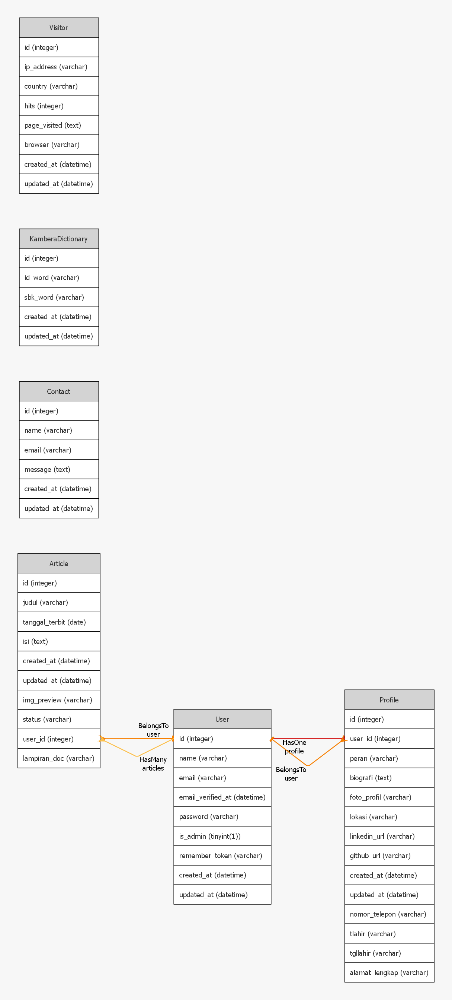

# Full-Stack Portfolio & CMS System

A robust personal website and Content Management System (CMS) built with Laravel 12. This platform showcases advanced backend features, social authentication, real-time analytics, and localized services, all accessible through a dedicated US gateway hub.

## 🌐 Live Links
* **Primary Entry Hub (US Recruiter Gateway):** [https://us.yandrien.my.id](https://us.yandrien.my.id)
* **Full Production System:** [https://yandrien.my.id](https://yandrien.my.id)

---

## 🚀 Key Features

* **Advanced Article CMS:** Complete CRUD operations featuring secure image uploads and integration with the TinyMCE rich text editor.
* **Social Authentication:** Secure, seamless user login integrated via Google and Facebook OAuth 2.0.
* **Custom Visitor Analytics:** Built-in tracking system monitoring unique visitors, IP addresses, country-level geolocation, and automated bot detection.
* **Engineered Multi-Language Support:** Custom implementation leveraging the Google Translate API combined with tailored JavaScript and CSS overrides for smooth localized UI transitions.
* **Asynchronous Regional Dictionary:** A dedicated regional language dictionary powered by real-time, asynchronous search queries via jQuery and AJAX.
* **Responsive UI/UX:** Clean, modern, and mobile-first user interface styled using Tailwind CSS.

---

## 🛠️ Tech Stack

* **Backend:** PHP 8.2+, Laravel 12 (Modern MVC Architecture, Robust Session Security, and Authentication)
* **Frontend:** Blade Templates, Tailwind CSS, JavaScript (jQuery, AJAX)
* **Database:** MySQL
* **Tools & Deployment:** Git (Version Control), Composer, cPanel Production Hosting

---

## 🗄️ Database Architecture (ERD)
Below is the Entity Relationship Diagram showcasing the database schema, user authentication tracking, and CMS article relationships:

---

## 📸 Screenshots

---

## 💻 Local Installation & Setup

Follow these procedures to clone the repository and execute the environment locally:

1. **Clone the repository:**

	git clone [https://github.com/yandrien/yandrien.my.id.git](https://github.com/yandrien/yandrien.my.id.git)
	
	cd yandrien.my.id

2. **Install Composer dependencies:**

	composer install

3. **Environment Configuration:**
	- Duplicate the environment template:
	
		cp .env.example .env
		
	- Open the newly created .env file and configure your local MySQL database connection details:
		
		DB_DATABASE=your_local_database_name
		DB_USERNAME=root
		DB_PASSWORD=
		
4. **Generate Application Key:**

	php artisan key:generate
	
5. **Run Migrations and Database Seeding:**

	php artisan migrate --seed
		
6. **Serve the Application:**

	php artisan serve
	
	Access the local development server at http://127.0.0.1:8000
	
---	
	
📄 Developer: Yandrien Landu Wohangara